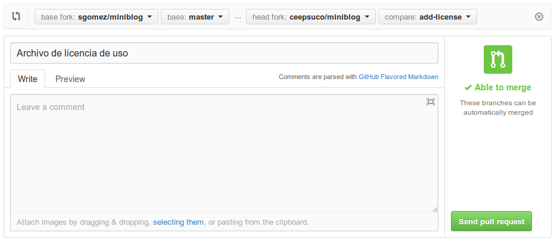
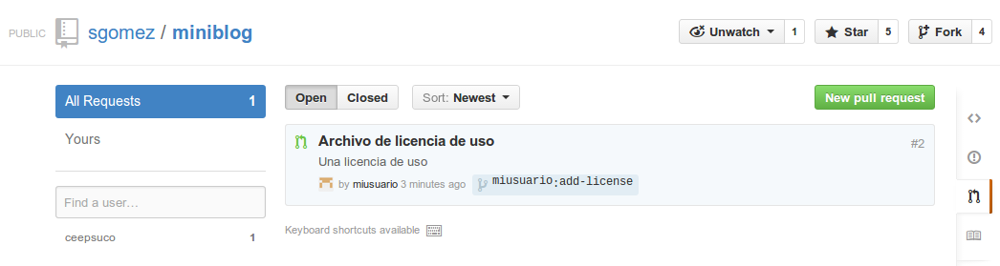

# Github avanzado

Esta sección trata de cómo colaborar con proyectos de terceros.

## Clonar un repositorio

Nos vamos a la web del proyecto en el que queremos colaborar. En este caso el proyecto se encuentra en [https://github.com/sgomez/miniblog](https://github.com/sgomez/miniblog). Pulsamos en el botón de fork y eso creará una copia en nuestro perfil.

Una vez se termine de clonar el repositorio, nos encontraremos con el espacio de trabajo del mismo:

- En la parte superior información sobre los commits, ramas, etiquetas, etc.
- Justo debajo un explorador de archivos.
- En la parte derecha un selector para cambiar de contexto entre: explorador de código, peticiones de colaboración (pull request), wiki, configuración, etc.
- Justo abajo a la derecha información sobre como clonar localmente o descargar un proyecto.

Github nos permite clonar localmente un proyecto por tres vías: HTTPS, SSH y Subversion. Seleccionamos SSH y copiamos el texto que después añadiremos a la orden `git clone` como en la primera línea del siguiente grupo de órdenes:

    $ git clone git@github.com:miusuario/miniblog.git
    $ cd miniblog
    $ composer.phar install
    $ php console create-schema

Lo que hace el código anterior es:

1. Clona el repositorio localmente
2. Entramos en la copia
3. Instalamos las dependencias que la aplicación tiene
4. Arrancamos un servidor web para pruebas

Y probamos que nuestra aplicación funciona:

    $ php -S localhost:9999 -t web/

Podemos usar dos direcciones para probarla:

- Frontend: `http://localhost:9999/index_dev.php`
- Backend: `http://localhost:9999/index_dev.php/admin/` con usuario admin y contraseña 1234.

### Sincronizar con el repositorio original

Cuando clonamos un repositorio de otro usuario hacemos una copia del original. Pero esa copia es igual al momento en el que hicimos la copia. Cuando el repositorio original cambie, que lo hará, nuestro repositorio no se actualizará solo. ¡Son dos repositorios diferentes! Necesitamos una manera de poder incorporar los cambios que vaya teniendo el repositorio original en el nuestro. Para eso crearemos una nueva rama remota. Por convenio, y como vimos anteriormente, ya existe una rama remota llamada _origin_ que apunta al repositorio de donde clonamos el proyecto, en este caso apunta a nuestro fork en github:

    $ git remote show origin
    * remote origin
      Fetch URL: git@github.com:miusuario/miniblog.git
      Push  URL: git@github.com:miusuario/miniblog.git
      HEAD branch (remote HEAD is ambiguous, may be one of the following):
        develop
        master
      Remote branches:
        develop tracked
        master  tracked
      Local branch configured for 'git pull':
        master merges with remote master
      Local ref configured for 'git push':
        master pushes to master (up to date)

También por convenio, la rama remota que hace referencia al repositorio original se llama _upstream_ y se crea de la siguiente manera:

    $ git remote add upstream git@github.com:sgomez/miniblog.git
    $ git remote show upstream
    * remote upstream
      Fetch URL: git@github.com:sgomez/miniblog.git
      Push  URL: git@github.com:sgomez/miniblog.git
      HEAD branch: master
      Remote branches:
        develop new (next fetch will store in remotes/upstream)
        master  new (next fetch will store in remotes/upstream)
      Local ref configured for 'git push':
        master pushes to master (local out of date)

En este caso, la URI debe ser siempre la del proyecto original. Y ahora para incorporar actualizaciones, usaremos el merge en dos pasos:

    $ git fetch upstream
    $ git merge upstream/master

Recordemos que _fetch_ solo trae los cambios que existan en el repositorio remoto sin hacer ningún cambio en nuestro repositorio. Es la orden _merge_ la que se encarga de que todo esté sincronizado. En este caso decimos que queremos fusionar con la rama _master_ que está en el repositorio _upstream_.

### Creando nuevas funcionalidades

Vamos a crear una nueva funcionalidad: vamos a añadir una licencia de uso. Para ello preferentemente crearemos una nueva rama.

    $ git checkout -b add-license
    $ echo "LICENCIA MIT" > LICESE
    # el error es intencionado
    $ git add LICESE
    $ git commit -m "Archivo de licencia de uso"

En principio habría que probar que todo funciona bien y entonces integraremos en la rama _master_ de nuestro repositorio y enviamos los cambios a Github:

    $ git checkout master
    $ git merge add-license --no-ff
    $ git branch -d add-license
    # Borramos la rama que ya no nos sirve para nada
    $ git push --set-upstream origin add-license
    # Enviamos la rama a nuestro repositorio origin

Si volvemos a Github, veremos que nos avisa de que hemos subido una nueva rama y si queremos crear un pull request.

Pulsamos y entramos en la petición de _Pull Request_. Este es el momento para revisar cualquier error antes de enviar al dueño del repositorio. Como vemos hemos cometido uno, nombrando el fichero, si lo correguimos debemos hacer otro push para ir actualizando la rama. Cuando esté lista volvemos aquí y continuamos. Hay que dejar una descripción del cambio que vamos a hacer.

Una vez hemos terminado y nos aseguramos que todo está correcto, pulsamos _Send pull request_ y le llegará nuestra petición al dueño del proyecto.

Sin embargo, para esta prueba, no vamos a cambiar el nombre del archivo y dejaremos el error como está. Así de esta manera al administrador del proyecto le llegará el _Pull Request_ y la lista de cambios. Ahora en principio, cabría esperar que el administrador aprobara los cambios, pero podría pasar que nos indicara que cambiemos algo. En ese caso solo habría que modificar la rama y volverla a enviar.

    $ git mv LICESE LICENSE
    $ git commit -m "Fix: Nombre de archivo LICENSE"
    $ git push

Ahora sí, el administrador puede aprobar la fusión y borrar la rama del repositorio. El panel de Github permite aceptar los cambios directamente o informa de como hacer una copia de la rama ofrecida por el usuario para hacer cambios, como puede verse en la siguiente imagen.

Una vez que se han aceptado los cambios, podemos borrar la rama y actualizar nuestro repositorio con los datos del remoto como hicimos antes. ¿Por qué actualizar desde el remoto y no desde nuetra rama _add-license_? Pues porque usualmente el administrador puede haber modificado los cambios que le hemos propuesto, o incluso una tercera persona. Recordemos el cariz colaborativo que tiene Github.

    $ git checkout master
    $ git branch -d add-license
    # Esto borra la rama local
    $ git push origin --delete add-license
    # Esto borra la rama remota. También puede hacerse desde la web.

### Todo esto es algo complicado...

Sí, lo es, al menos al principio. Git tiene una parte muy sencilla que es el uso del repositorio local (órdenes tales como add, rm, mv y commit). El siguiente nivel de complejidad lo componen las órdenes para trabajar con ramas y fusionarlas (checkout, branch, merge, rebase) y por último, las que trabajan con repositorios remotos (pull, push, fetch, remote). Además hay otra serie de órdenes para tener información (diff, log, status) o hacer operaciones de mantenimiento (fsck, gc). Lo importante para no perderse en Git, es seguir la siguiente máxima:

> No avanzar al siguiente nivel de complejidad, hasta no haber entendido completamente el anterior.

Muy poco sentido tiene ponernos a crear ramas en github si aún no entendemos cómo se crean localmente y para que deben usarse. En la parte de referencias hay varios manuales en línea, incluso tutoriales interactivos. También hay mucha documentación disponible en Github que suele venir muy bien explicada. En caso de que tengamos un problema que no sepamos resolver, una web muy buena es [StackOverflow](http://stackoverflow.com/). Es una web de preguntas y respuestas para profesionales; es muy difícil que se os plantee una duda que no haya sido ya preguntada y respondida en esa web. Eso sí, el inglés es imprescindible.

## Último paso, documentación.

Github permite crear documentación. En primer lugar, generando un archivo llamado `README.md`. También permite crear una web propia para el proyecto y, además, una wiki. Para marcar el texto, se utiliza un lenguaje de marcado de texto denominado _Markdown_. En la siguiente web hay un tutorial interactivo: [http://www.markdowntutorial.com/](http://www.markdowntutorial.com/). Como en principio, no es necesario saber Markdown para poder trabajar con Git o con Github, no vamos a incidir más en este asunto.

En el propio GitHub podemos encontrar algunas plantillas que nos sirvan de referencia.

Algunos ejemplos:

- [Plantilla básica](https://gist.github.com/PurpleBooth/109311bb0361f32d87a2)
- [Plantilla avanzada](https://github.com/othneildrew/Best-README-Template)

### Documentación del curso

Esta documentación está hecha en Markdown y pasada a HTML gracia a la herramienta [mkdocs](https://www.mkdocs.org/). La plantilla usada es [Material for MkDocs](https://squidfunk.github.io/mkdocs-material/).

El material está publicado con licencia [Atribución-NoComercial 4.0 Internacional (CC BY-NC 4.0)](https://creativecommons.org/licenses/by-nc/4.0/deed.es)
