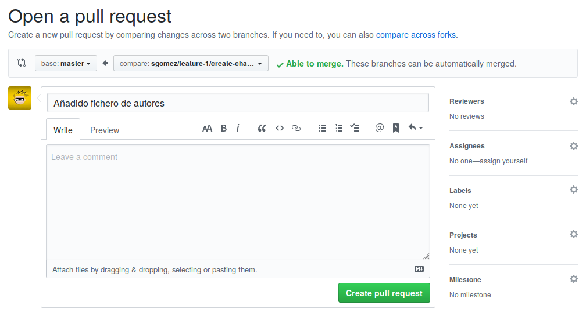

# Flujo de trabajo en GitHub

## Paso 0. Abrir una incidencia (issue)

Habitualmente el trabajo puede partir a raíz de una reporte por parte de un miembro del equipo o de una persona externa. Para eso tenemos la sección _Issues_.

Una issue cuando se crea se compone de un título y una descripción en
Markdown. Si la persona es miembro del equipo, opcionalmente puede
asignarle una serie de metadatos: etiquetas (labels), hitos
(milestone), proyecto al que pertenece o responsables encargados
de cerrar la incidencia.

Una vez creado, al mismo se le asignará un número.ç

!!! example

    Vamos a crear una incidencia llamada "Crear archivo de autores", donde indiquemos que vamos a crear un archivo `AUTHORS.md` con
    la lista de desarrolladores del proyecto.

## Paso 1. Crear una rama

Crearemos una rama cada vez que queramos implementar una nueva característica al proyecto que estamos realizando. La misma puede estar provocada por una incidencia o no.

!!! tip

    Es una buena costumbre crear en Issues el listado de casos de uso,
    requisitos, hostorias de usuario o tareas (como lo queramos llamar),
    para tener un registro del trabajo que llevamos y el que nos queda.

El nombre de la rama puede ser el que creamos conveniente, pero hay que
intentar ser coherente y usar siempre el mismo método, sobre todo si
trabajamos en equipo.

Un método puede ser el siguiente:

    $ # tipo-número/descripción
    $ git checkout -b feature-1/create-changelog
    $ git checkout -b hotfix-2/updated-database

En entornos de trabajo multiusuario se puede usar el siguiente:

    $ # usuario/tipo-número/descripción
    $ git checkout -b sgomez/feature-1/create-changelog
    $ git checkout -b sgomez/hotfix-2/updated-database

De esa manera, podemos seguir fácilmente quién abrió la rama, en qué consiste y a qué _issues_ está conectada. Pero como decimos es más un convenio que una imposición, pudiéndole poner el nombre que queramos.

Vamos a crear la rama y los commits correspondientes y subir la rama con push al servidor.

    $ git checkout -b sgomez/feature-1/create-changelog
    $ git add AUTHORS.md
    $ git commit -m "Añadido fichero de autores"

El archivo puede contener, por ejemplo, lo siguiente:

    # AUTHORS

    * Sergio Gómez <sergio@uco.es>

Hacemos push y obtenemos algo como esto:

    $ git push
    fatal: The current branch sgomez/feature-1/create-changelog has no upstream branch.
    To push the current branch and set the remote as upstream, use

        git push --set-upstream origin sgomez/feature-1/create-changelog

Como la rama es nueva, git no sabe _dónde_ debe hacer push. Le indicamos que debe hacerla en _origin_ y además que guarde la vinculación (equivalente al parámetro -u que vimos en el capítulo anterior). Probamos de nuevo:

    $ git push -u origin sgomez/feature-1/create-changelog
    Enumerating objects: 4, done.
    Counting objects: 100% (4/4), done.
    Delta compression using up to 4 threads
    Compressing objects: 100% (2/2), done.
    Writing objects: 100% (3/3), 1.03 KiB | 1.03 MiB/s, done.
    Total 3 (delta 0), reused 0 (delta 0)
    remote:
    remote: Create a pull request for 'sgomez/feature-1/create-changelog' on GitHub by visiting:
    remote:      https://github.com/sgomez/taller-de-git/pull/new/sgomez/feature-1/create-changelog
    remote:
    To github.com:sgomez/taller-de-git.git
    * [new branch]      sgomez/feature-1/create-changelog -> sgomez/feature-1/create-changelog
    Branch 'sgomez/feature-1/create-changelog' set up to track remote branch 'sgomez/feature-1/create-changelog' from 'origin'.

Ahora la rama ya se ha subido y nos informa, además, de que podemos crear un _Pull Request_ (PR). Si vamos al enlace que nos aparece veremos lo siguiente:

Aquí podemos informar de en qué consiste la rama que estamos enviando. Si ya tenemos una _issue_ abierta, no es necesario repetir la misma información. Podemos hacer referencia con el siguiente texto:

    Closes #1

Esto lo que le indica a GitHub que esta PR cierra el _issues_ número 1. Cuando se haga el merge de la rama, automáticamente se cerrará la incidencia.

Lo hacemos y le damos a crear.

## Paso 2. Crear commits

A partir de ahora podemos seguir creando commits en local y enviarlos hasta que terminemos de trabajar.

Editamos el archivo AUTHORS.md .

    # AUTHORS

    * Sergio Gómez <sergio@uco.es>
    * John Doe

Y mandamos otro commit

    $ git commit -am "Actualizado AUTHORS.md"
    $ git push

Si volvemos a la página de PR, veremos que aparece el nuevo commit que acabamos de enviar.

## Paso 3. Discutir

GitHub permite que entre los desarrolladores se pueda abrir una discusión sobre el código, de tal manera que el trabajo de crear la rama sea colaborativo. Se puede incluso pedir revisiones por parte de terceros y que esas revisiones sean obligatorias antes de aceptar los cambios.

## Paso 4. Desplegar

Una vez que hemos terminado de crear la función de la rama ya podemos incorporar los cambios a _master_. Este trabajo ya no es necesario hacerlo en local y GitHub nos proporciona 3 maneras de hacerlo:

### Crear un merge commit

Esta opción es el equivalente a hacer lo siguiente en nuestro repositorio:

    $ git checkout master
    $ git merge --no-ff sgomez/feature-1/create-changelog
    $ git push

Es decir, el equivalente a hacer un merge entre nuestra rama y master.

!!! info
GitHub siempre desactiva el _fast forward_.

### Crear un rebase y merge

Esta opción es el equivalente a hacer lo siguiente en nuestro repositorio

    $ git rebase master
    $ git checkout master
    $ git merge --no-ff sgomez/feature-1/create-changelog
    $ git push

Es decir, nos aseguramos de que nuestra rama está al final de _master_ haciendo _rebase_, como vimos en el capítulo de ramas, y posteriormente se hace el merge.

### Crear un squash commit y un merge

Esta opción es el equivalente a hacer lo siguiente en nuestro repositorio:

    $ git checkout master
    $ git merge --squash sgomez/feature-1/create-changelog
    $ git push

Esta opción es algo especial. En vez de aplicar cada uno de los commits en la rama master, ya sea directamente (_fast forward_) o no, lo que hace es crear un solo commit con los cambios de todos los commits de la rama. El efecto final es como si en la rama solo hubiera producido un solo commit.

Vamos a seleccionar este último (squash and merge) y le damos al botón para activarlo. Nos saldrá una caja para que podamos crear una descripción del commit y le damos a confirmar.

Ya hemos terminado y nos aparecerá una opción para borrar la rama, lo más recomendado para no tener ramas obsoletas.

Las consecuencias de esta acción son las siguientes:

1. El PR aparecerá como estado _merged_ y en la lista de PR como cerrado.
1. El _issue_ que abrimos se habrá cerrado automáticamente.
1. En el listado de commits aparecerá solo uno con un enlace al PR (en vez de los dos commits que hicimos).

## Paso 5. Sincronizar

Hemos cambiado el repositorio en GitHub, pero nuestra rama master no contiene los mismos cambios que el de origin. Así que nos toca sincronizar y borrar la rama obsoleta:

    $ git checkout master
    $ git pull --rebase --autostash
    $ git branch -D sgomez/feature-1/create-changelog

!!! info

    ¿Por qué _squash and merge_ y no un _merge_ o _rebase_? De nuevo
    depende de los gustos de cada equipo de desarrollo. Las cracterísticas de _squash_ es que elimina (relativamente) rastros de errores intermedios mientras se implementaba la rama, deja menos commits en la rama _master_ y nos enlace al PR donde se implementaron los cambios.

    Para algunas personas estas características son unas ventajas, para otras no. Lo mejor es experimentar cada opción y cada uno decida
    como quiere trabajar.
